# Compilation guide for devcontainers in Visual Studio Code

This guide contains instructions for compiling Cataclysm-DDA in Visual Studio Code using a [Devcontainer](https://code.visualstudio.com/learn/develop-cloud/containers)

The devcontainer was introduced in [#65748](https://github.com/CleverRaven/Cataclysm-DDA/pull/65748). These instructions were written using Visual Studio Code version 1.80.1 on Debian 11

## Prerequisites:

* Visual Studio Code
* [Docker](https://docs.docker.com/engine/install/)


## Installation:

1. Install all prerequisites.
2. Clone your fork of the CleverRaven/Cataclysm-DDA repo and create a branch
3. Add Cleverraven as the remote upstream with git remote add upstream git@github.com:CleverRaven/Cataclysm-DDA.git
4. Open the folder where you cloned your repository in Visual Studio Code via the UI or by navigating to the directory in a terminal and typing Code
5. Visual Studio Code will show a pup-up in the bottom right with recommended extentions. Install those.
6. If you don't plan to compile the object creator, open the Dockerfile in the VSCode file browser and scroll down to find this section:
  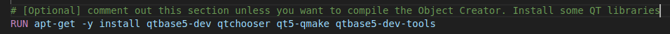

  comment out that part so it looks like this:
  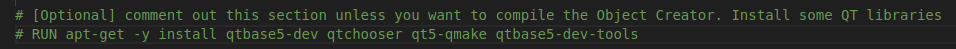

If you don't plan to cross-compile the game, scroll down to find this section:

  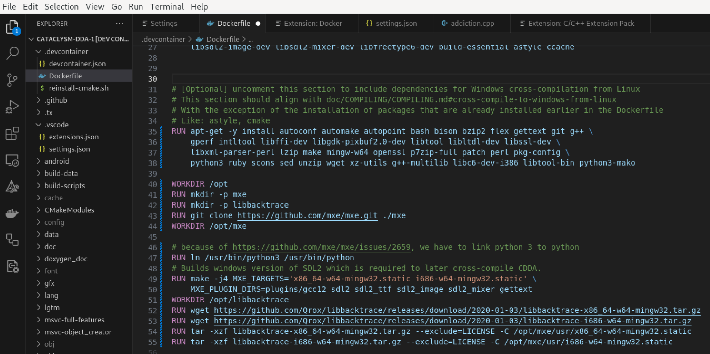

  comment out that part (select it and press ctrl+/ in vscode) so it looks like this:
  

Next, scroll down to find this section:
  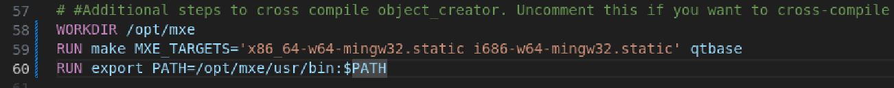
  
  comment that part out (select it and press ctrl+/ in vscode) so it looks like this:

  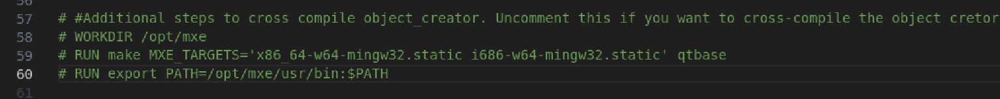

  
7. Now restart visual studio code. When prompted, click "Reopen in container":
   
  

  7.1 Linux only: You may see this message:
  
  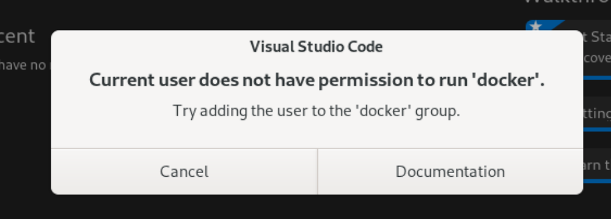
  
  In that case, add the user to the docker group using the terminal:
  
  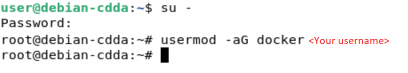

  After that, log out of your account and log back in so the permissions are updated. If that doesn't work, reboot your computer.

  
8. Allow the container to build and for VSCode to Reopen. If everything goes well, you will see the container running:

  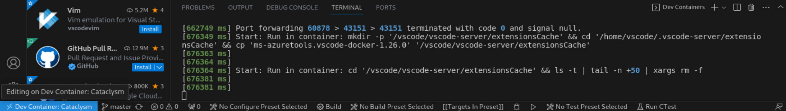


9. Select the makefile extension on the bottom left and choose your desired configuration. Press the "Play" button to build the project

  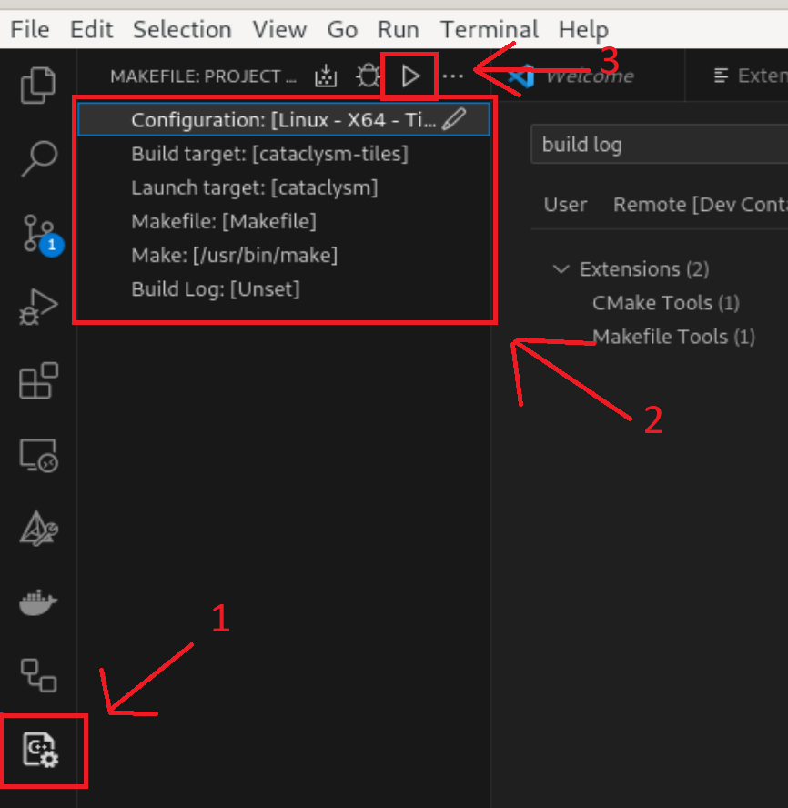


  
The build result should be located in the folder where you cloned your fork to (e.g. /Documents/git/Cataclysm-DDA)

If you want to run cataclysm-tiles locally, open a terminal on your linux machine and install these packages: `apt-get update && export DEBIAN_FRONTEND=noninteractive && apt-get -y install --no-install-recommends libsdl2-dev libsdl2-ttf-dev libsdl2-image-dev libsdl2-mixer-dev libfreetype6-dev build-essential astyle ccache`

You can then test your build on your linux machine by opening a terminal in the `/Documents/git/Cataclysm-DDA` folder and using this command:
```bash
./cataclysm-tiles
```


# Cross-compiling from Linux to Windows
1. Follow all of the steps written earlier in this guide

2. Open the Dockerfile in the VSCode file browser and scroll down to find this section:

  

  Uncomment that part (select it and press ctrl+/ in vscode) so it looks like this:
  
  

3. Save the Dockerfile and re-open VSCode. Allow the Devcontainer to rebuild. This is going to take a while (45 minutes depending on the performance of your computer)

  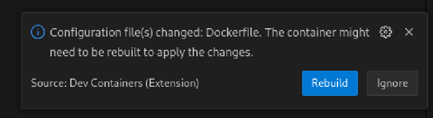

4. Go to the makefile extention and set the makefile settings as follows:

  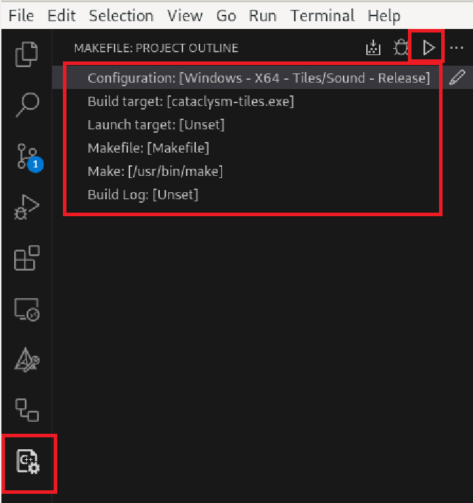
  
  Next, press the play button to build the game. After it is build, you should see the cataclysm-tiles.exe file in the folder where you cloned your fork to (e.g. /workspaces/Cataclysm-DDA)


# Cross-compiling object creator from Linux to Windows
These steps allow you to cross-compile the object creator from Linux to Windows

1. Follow all of the steps written earlier in this guide

2. Open the Dockerfile in the VSCode file browser and scroll down to find this section:

  

  Uncomment that part (select it and press ctrl+/ in vscode) so it looks like this:
  
  

3. Save the Dockerfile and re-open VSCode. Allow the Devcontainer to rebuild. This is going to take a while (45 minutes depending on the performance of your computer)

  

4. After the devcontainer is build, enter the following command into the terminal in vscode (you may need to click the + sign to open a new terminal): `make object_creator.exe CROSS="/opt/mxe/usr/bin/x86_64-w64-mingw32.static-" TILES=1 SOUND=1 RELEASE=1 LOCALIZE=1 PREFIX=output PCH=0 MXE_TARGETS='x86_64-w64-mingw32.static'`

  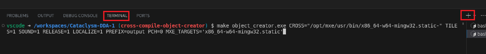

  Note: This will only work if you first build the windows version of cataclysm-tiles as described in [Cross-compiling from Linux to Windows](https://github.com/CleverRaven/Cataclysm-DDA/blob/master/doc/COMPILING/COMPILING-DEVCONTAINER.md#cross-compiling-from-linux-to-windows).

  Note 2: If you want to make a clean built, enter `make clean-object_creator` in the terminal before you run the build command.

  This will build the object creator. After it is build, you should see the object_creator.exe file object_creator folder inside the folder where you cloned your fork to (e.g. /workspaces/Cataclysm-DDA/object_creator). Copy /object_creator/object_creator.exe to your windows machine in the same folder as cataclysm-tiles.exe

