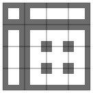
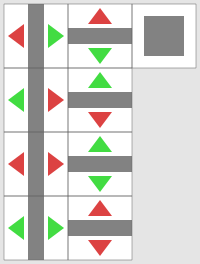
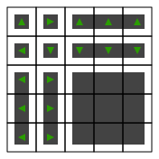

# TILESETS

*Content*

- [Terminology](#terminology)
- [JSON Schema](#json-schema)
- [`compose.py`](#composepy)
- [pyvips](#pyvips)
- [Including tilesets with the distribution](#including-tilesets-with-the-distribution)
- [Legacy tilesets](#legacy-tilesets)

>[!NOTE]
>If you are looking for specific tileset information or style guides, try the tileset repository:
> - [Main page](https://github.com/I-am-Erk/CDDA-Tilesets)
> - [Tilesets documentation](https://github.com/I-am-Erk/CDDA-Tilesets/tree/master/doc)
> - [Rendered documentation](https://i-am-erk.github.io/CDDA-Tilesets/)

## Terminology

##### Tileset
A package of images for the game.

##### Sprite
A single image that represents either an individual game entity or a common background

##### Root name
File name without an extension.

##### Tile
A unit square in the game world with certain coordinates, where entities can exist and on which sprites are drawn. Sometimes used (incorrectly) in place of "sprite".

##### Tilesheet
A collection of sprites with identical sizes and offsets composited into one image file that the game will read.

##### `tile_config.json` file
Machine-readable description mapping the contents of tilesheets to game entities.

##### `tileset.txt` file
A collection of tileset metadata.

##### Tile entry
JSON configuration object that describes which sprites are used for which game entities and how.

##### Compositing Tileset
A tileset that is stored as directories of individual sprites and tile entries.

##### `compose.py` script
Converts a compositing tileset into package suitable for the game: a set of tilesheets and the `tile_config.json`.

##### Tilesheet directory
Compositing tileset subdirectory containing sprites and tile entries.

##### `tile_info.json` file

Describes tilesheet directories for `compose.py`

## JSON Schema

### Tile entry
```C++
{                                           // The simplest version
    "id": "mon_cat",                        // a game entity ID
    "fg": "mon_cat_black",                  // a sprite root name that will be put on foreground
    "bg": "shadow_bg_1"                     // another sprite root name that will be the background; can be empty for no background
}
```

Sprites can be referenced across tilesheet directories, but they must be stored in a tilesheet directory with their size and offset.

`id` can be an array of multiple game entity IDs sharing the same sprite configuration, like `"id": ["vp_door", "vp_hddoor"]`.  `id` game values that are used as-is include terrain, furniture, items (except corpses), monsters, fields, traps.

#### Hardcoded IDs

The special ID `unknown` provides a sprite that is displayed when an entity has no other sprite. Other hardcoded IDs also exist, and most of them are referenced in [`src/cata_tiles.cpp`](/src/cata_tiles.cpp). A full list of hardcoded IDs _may_ be present in [`tools/json_tools/generate_overlay_ids.py`](/tools/json_tools/generate_overlay_ids.py) stored as `CPP_IDS` but it's updated manually and may lag behind. Other IDs may be found below.

Running trail animations (game.cpp):
`run_nw` Player running towards north-west.
`run_n`
`run_ne`
`run_w`
`run_e`
`run_sw`
`run_s`
`run_se`

Bashing animations (handle_action.cpp):
`bash_complete` Bash results in destruction of target.
`bash_effective` Bash effective but target not yet destroyed.
`bash_ineffective` Bash not effective.

Shadows (cata_tiles.cpp):
`shadow` Drawn when creature present in tiles above.

#### Complex IDs

Special prefixes that are used include:

`overlay_effect_` for effects.

`overlay_mutation_` and `overlay_mutation_active_` for both mutations and bionics.

`overlay_worn_` and `overlay_wielded_` for items being worn or wielded by characters.

`corpse_` for corpses.

`overlay_` for movement modes.

`vp_` for vehicle parts (see also [`symbols` and `standard_symbols` JSON keys](JSON_INFO.md#symbols-and-variants) that are used as suffixes).

`explosion_` for spell explosion effects.  Multitile is required; only supports "center", "edge" and "corner".

Special suffixes that are used include:

`_intx` for fields with a specific intensity level where x is the intensity level. Intensity counts from 1 and there are usually three levels so: `_int1` `_int2` `_int3`

#### Optional gendered variants

Are defined by adding `_female` or `_male` part to the `overlay_` part of a prefix before other parts: `overlay_female_` or `overlay_male_`, `overlay_female_worn_`, `overlay_male_worn_`.

#### Optional seasonal variants

Are defined by adding `_season_spring`, `_season_summer`, `_season_autumn`, or `_season_winter` suffix to any tile entry `id`. For example `"id": "mon_wolf_season_winter"`.

#### Optional transparent variant

Defined by adding `_transparent` suffix to any tile entry `id`. For example `"id": "t_wall_transparent"`. The transparent version is used to prevent occlusion by high tiles, especially in ISO tilesets.

#### Item/Mutation variant sprite variants

Are defined by adding `_var_variant_id`, where `variant_id` is replaced by the id of the variant you want to sprite.

e.g. for an item with the id `item1`, with variants `orange` and `pear`, to specify a tile for the item, simply use `item1`. For the variants, use `item1_var_orange` and `item1_var_pear`.

#### Rotations

You can add `"rotates": true` to allow sprites to be rotated by the game automatically. Alternatively, `fg` and `bg` can be an array of 2 or 4 pre-rotated variants, like `"fg": ["mon_dog_left", "mon_dog_right"]` or `"bg": ["t_wall_n", "t_wall_e", "t_wall_s", "t_wall_w"]`.

#### Random variations

`fg` and `bg` can also be an array of objects of weighted, randomly chosen options, any of which can also be an array of rotations:
```C++
    "fg": [
        { "weight": 50, "sprite": "t_dirt_brown"},       // appears approximately 50 times in 53 tiles
        { "weight": 1, "sprite": "t_dirt_black_specks"}, // appears 1 time in 53 tiles
        { "weight": 1, "sprite": "t_dirt_specks_gray"},
        { "weight": 1, "sprite": "t_patchy_grass"}       // file names are arbitrary, but see `--use-all` option
    ],
```

#### Multitile

`"multitile": true` signifies that there is an `additional_tiles` object (redundant? [probably](https://github.com/CleverRaven/Cataclysm-DDA/issues/46253)) with one or more objects that define sprites for game entities associated with this tile, such as broken versions of an item, or wall connections.  Each object in the array has an `id` field, as above, and an `fg` field, which can be a single [root name](#root-name), an array of root names, or an array of objects as above. `"rotates": true` is implied with it and can be omitted.

#### Connecting terrain and furniture - `connect_groups` and `connects_to`

For terrain or furniture that is intended to auto-connect using multitiles, set the properties `connect_groups` and `connects_to` in the object definition (not in the tileset!) to an appropriate group:

```json
{
    "type": "terrain",
    "id": "t_brick_wall",
    ...
    "connect_groups": "WALL",
    "connects_to": "WALL",
    ...
}
```

For both properties, arrays of multiple groups are possible.

`connect_groups` adds the type to one or more groups, while `connects_to` makes the type connect to the given group(s).

Connections are only set up from types that have a `connects_to` group to types that have the same group in `connect_groups`.

For details, see JSON_INFO.md, sections [`connect_groups`](./JSON_INFO.md#connect_groups) and [`connects_to`](./JSON_INFO.md#connects_to).

Wall work out of the box without modifying terrain definitions, as the required group `WALL` is implied by the flags `WALL` and `CONNECT_WITH_WALL` for `connect_groups` as well as `connects_to` (i.e. symmetric relation).

For available connect groups, see [JSON_INFO.md, section Connection groups](./JSON_INFO.md#connection-groups).

For the full multitile, the 16 sprite variants of this template are required:



In JSON, the multitile would be defined like this:

```json
{
    ...
    "multitile": true,
    "additional_tiles": [
        {
            "id": "center",
            "fg": "t_wall_w_center"
        },
        {
            "id": "corner",
            "fg": [
                "t_wall_w_corner_nw", "t_wall_w_corner_sw",
                "t_wall_w_corner_se", "t_wall_w_corner_ne"
            ]
        },
        {
            "id": "t_connection",
            "fg": [
                "t_wall_w_t_connection_n", "t_wall_w_t_connection_w",
                "t_wall_w_t_connection_s", "t_wall_w_t_connection_e"
            ]
        },
        {
            "id": "edge",
            "fg": [ "t_wall_w_edge_ns", "t_wall_w_edge_ew" ]
        },
        {
            "id": "end_piece",
            "fg": [
                "t_wall_w_end_piece_n", "t_wall_w_end_piece_w",
                "t_wall_w_end_piece_s", "t_wall_w_end_piece_e"
            ]
        },
        {
            "id": "unconnected",
            "fg": [
                "t_wall_w_unconnected", "t_wall_w_unconnected"
            ]
        }
    ]
}
```

#### Auto-rotating terrain and furniture - `rotates_to`

Terrain and furniture can auto-rotate depending on other surrounding terrain or furniture using `rotates_to`.
For details, see JSON_INFO.md, sections [`connect_groups`](./JSON_INFO.md#connect_groups) and [`rotates_to`](./JSON_INFO.md#rotates_to).
Usage examples for terrain are doors and windows that look differently, seen from inside and outside (e.g. curtain).
An example for furniture are street lights that orient towards the pavement.

The mechanism works like to `connects_to`, and can be combined with it.
It also makes use of the same [Connection group](./JSON_INFO.md#connection-groups), given by property `connect_groups`.
Currently, however, auto-rotation is implemented only for `edge` and `end_piece` tiles (doors, windows, furniture) and `unconnected` tiles (e.g. street lights).

For the active/rotating type, `rotates_to` specifies a [Connection group](./JSON_INFO.md#connection-groups) the terrain should rotate towards (or rather, depend on).
For the passive/target type, `connect_groups` is used to add it to a connection group.

Terrain can only use terrain to rotate towards, while furniture can use both, terrain and furniture.

Presumably, either `edge` and `end_piece`, or `unconnected` will be used for a certain type, but rarely both at the same time. Therefore we give an example for windows using `edge` and `end_piece`, and for street lights using `unconnected`.

##### Windows and doors

Windows and doors (and probably other types) can render differently, depending on where inside and outside is.
These elements are normally only represented by `edge` in multitile terms. In case of a wall next to the window not being visible, it will be `end_piece`.
For each of the two basic `edge` and `end_piece` directions (north-south, east-west), 2 or 4 sprite variants are required. Further, one `unconnected` variant is required as fallback.



*(Green stands for `rotates_to` present, e.g. inside)*

The full multitile would be defined like this:

```json
{
  "id": [ "t_window", "t_window_domestic" ],
  "fg": "w_undefined",
  "multitile": true,
  "additional_tiles": [
    {
      "id": "edge",
      "fg": [
        "w_NS_W", "w_EW_S",
        "w_NS_E", "w_EW_N",
        "w_NS_BOTH", "w_EW_BOTH",
        "w_NS_NONE", "w_EW_NONE"
      ]
    },
    {
      "id": "end_piece",
      "fg": [
        "w_NS_W", "w_EW_S",
        "w_NS_E", "w_EW_N",
        "w_NS_BOTH", "w_EW_BOTH",
        "w_NS_NONE", "w_EW_NONE"
      ]
    },
    {
      "id": "unconnected",
      "fg": [
        "w_undefined",
        "w_undefined"
      ]
    }
  ]
}
```

> Note that the same sprites are used here for `edge` and `end_piece`.

The order of sprites ensures that the multitile also works with only the first 4 instead of all 8 sprites. It also makes it compatible with tilesets that don't use the `rotates_to` feature.

Doors and windows work out of the box without modifying terrain definitions, as the required group `INDOORFLOOR` is implied by the flags `WINDOW`, `DOOR` (active) and `INDOORS` (target/passive).

##### Unconnected `rotates_to`

For unconnected tiles, `rotates_to` requires either 4 or 16 sprites.
To create these sprites, the normal multitile template can be used with `slice_multitile.py`.
The generated JSON needs to be re-arranged like this (names as generated by the script):

```json
{
  "id": "f_street_light",
  "fg": "f_street_light_unconnected",
  "multitile": true,
  "additional_tiles": [
    {
      "id": "unconnected",
      "fg": [
        "f_street_light_end_piece_n",
        "f_street_light_end_piece_e",
        "f_street_light_end_piece_s",
        "f_street_light_end_piece_w",
        "f_street_light_corner_ne",
        "f_street_light_corner_se",
        "f_street_light_corner_sw",
        "f_street_light_corner_nw",
        "f_street_light_t_connection_n",
        "f_street_light_t_connection_e",
        "f_street_light_t_connection_s",
        "f_street_light_t_connection_w",
        "f_street_light_center",
        "f_street_light_edge_ew",
        "f_street_light_edge_ns",
        "f_street_light_unconnected"
      ]
    }
  ]
}
```

A minimal version using only the 4 cardinal directions can be achieved with only 4 sprites:

```json
{
  ...
  "additional_tiles": [
    {
      "id": "unconnected",
      "fg": [
        "f_street_light_end_piece_n",
        "f_street_light_end_piece_e",
        "f_street_light_end_piece_s",
        "f_street_light_end_piece_w"
      ]
    }
  ]
}
```

> Note: When drawing using the template, keep in mind that neighbours to rotate towards are where connections are.
> The directions at the end of each generated file name are ***not*** the directions to rotate to!
> Rather, they are the opposite.

##### Full `rotates_to` template

For terrain and furniture that connects as well as rotates, `slice_multitile.py` can be used on a 5x5 autotile template like this:



As for normal autotiles, the script also generates the requires JSON file. See there for the order of rotated elements.

#### Multiple tile entries in the same file

Each JSON file can have either a single object or an array of one or more objects:
```C++
[
    { "id": "mon_zombie", "fg": "mon_zombie", "bg": "mon_zombie_bg" },
    { "id": "corpse_mon_zombie", "fg": "mon_zombie_corpse", "bg": "mon_zombie_bg" },
    { "id": "overlay_wielded_corpse_mon_zombie", "fg": "wielded_mon_zombie_corpse" }
]
```

#### Graffitis

For graffitis, rotation can be used to distinguish between wall and floor drawings:

```json
{
  "id": "graffiti",
  "fg": [ "graffiti_wall", "graffiti_floor" ],
}
```

Weighted variations are also possible, and can be combined with rotation:

```json
{
  "id": "graffiti",
  "fg": [
    { "weight": 1, "sprite": [ "graffiti_01_wall", "graffiti_01_floor" ] },
    { "weight": 1, "sprite": [ "graffiti_02_wall", "graffiti_02_floor" ] },
  ],
}
```

Variant selection is based on the graffiti's text, so the same text will always result in the same variant shown.

##### Graffitis for specific texts

It is possible to create graffitis for specifix texts.

The game looks up graffiti sprites by the pattern `graffiti_THE_GRAFFITI_TEXT`. If no such sprite is found, `graffiti` is used.

To create the sprite id, the graffiti's text is:
* truncated to 32 characters
* converted to capital letters
* all punctuation is removed
* special characters are removed
* spaces are replaced by underscores

So, e.g. all these texts would result in lookup for `graffiti_NO_FUTURE`: "no future", "No Future!!!", "no_future".
"Escape Pods & Vehicle Bay" becomes `graffiti_ESCAPE_PODS__VEHICLE_BAY`

### `tile_info.json`
```c++
[
  {                         // default sprite size
    "width": 32,
    "height": 32,
    "pixelscale": 1         //  Optional. Sets a multiplier for resizing a tileset. Defaults to 1.
  }, {
    "tiles.png": {}         // Each tilesheet directory must have a corresponding object
  }, {                      // with a single key, which will become the tilesheet output filename.
    "expan.png": {}         // Empty object means the default sprite size and no offsets.
  }, {
    "tree.png": {
      "sprite_width": 64,   // Overriding values example
      "sprite_height": 80,
      "sprite_offset_x": -16,
      "sprite_offset_y": -48,
      "pixelscale": 2,      // Optional. Sets a multiplier for resizing tiles. Multiplied/on top of by tileset pixelscale. Defaults to 1.
      "sprites_across": 4   // Change the sheet width, default is 16. Reducing empty space in the end helps a bit with CDDA memory consumption
    }
  }, {
    "fillerhoder.png": {    // Unknown keys like `source` will be ignored by `compose.py` and can be used as comments.
      "source": "https://github.com/CleverRaven/Cataclysm-DDA/tree/b2d1f9f6cf6fae9c5076d29f9779e0ca6c03c222/gfx/HoderTileset",
      "filler": true,
      "exclude": [          // all subdirectories of this sheet directory mentioned here will not be visited
        "dir_that_will_be_ignored",
        "subdir/with/any/depth"
      ]
    }
  }, {
    "fallback.png": {
      "fallback": true
    }
  }
]
```

Tilesheet directory names are expected to use the following format: `pngs_{tilesheet_root_name}_{sprite_width}x{sprite_height}` - such as `pngs_tiles_32x32`, `pngs_expan_32x32`, `pngs_tree_64x80`, etc. To improve performance, keep the number of tilesheets to a minimum.

`"filler": true` means the tilesheet is a filler; tile entries within it will be used only if IDs in them were not mentioned in any preceding tile entry.  Sprites within a filler directory will be ignored if another one with the same name was already encountered.  A filler tilesheet is useful when upgrading the art in a tileset: old, low-quality art can be placed on filler tilesheet and will be automatically replaced as better images are added to the non-filler tilesheets.

`"fallback": true` means the tilesheet is a fallback; it will be treated as a source of fallback ASCII character sprites.  `compose.py` will also append the fallback tilesheet to the end of the tileset, and will add a "fallback.png" to `tile_config.json` if there is no `fallback` entry in `tile_info.json`.

### Expansion tile entries

A tilesheet can be an expansion from a mod.  Each expansion tilesheet is a single `id` value, where the `"rotates": false"`, and `"fg": 0` keys are set.  Expansion tile entry JSONs are the only tile entry JSONs that may use an integer value for `fg`, and that value must be 0.  Expansion tile entry JSONs must be located at the top layer of each tilesheet directory.

### layering.json

An optional file called layering.json can be provided. this file defines layering data for specific furniture and terrain. A default layering.json is provided with the repository. an example would be:

```c++
{
"variants": [
  {
    "context": "f_desk",
    "item_variants": [
      {
        "item": "laptop",
        "sprite": [{"id": "desk_laptop", "weight": 1}],
        "layer": 90,
        "offset_x": 16,
        "offset_y": -48
      },
      {
        "item": "pen",
        "sprite": [{"id": "desk_pen_1", "weight": 2}, {"id": "desk_pen_2", "weight": 2}],
        "layer": 100
      }
    ],
    "field_variants": [
      {
        "field": "fd_fire",
        "sprite": [{"id": "desk_fd_fire", "weight": 1}],
        "offset_x": 16,
        "offset_y": -48
      }
    ]
  }
]
}
```

This entry sets it so that the f_desk furniture if it contains either a pen or a laptop will draw a custom sprite for them in addition to a normal top item sprite.

`"context": "f_desk"` the furniture or terrain that this should apply to.

##### Items

`"item_variants":` the definitions for what items will have a variant sprite.

`"item": "laptop"` the item id. (only supported in item_variants)

`"layer": 100` this defines the order the sprites will draw in. 1 drawing first 100 drawing last (so 100 ends up on top). This only works for items, Fields are instead drawn in the order they are stacked on the tile.

`"sprite": [{"id": "desk_pen_1", "weight": 2}, {"id": "desk_pen_2", "weight": 2}]` an array of the possible sprites that can display. For items multiple sprites can be provided with specific weights and will be selected at random.

`"offset_x": 16`, `"offset_y": -48` optional sprite offset.

##### Fields

`"field_variants":` the definitions for what fields will have a variant sprite.

`"field": "fd_fire"` the field id. (only supported in field_variants)

`"sprite": [{"id": "desk_fd_fire", "weight": 1}]` A field can have at most one sprite.

`"offset_x": 16`, `"offset_y": -48` optional sprite offset.

## `compose.py`

[`tools/gfx_tools/compose.py`](/tools/gfx_tools/compose.py)

### Usage

`compose.py [-h] [--use-all] [--obsolete-fillers] [--palette] [--palette-copies] source_dir [output_dir]`

`source_dir` - the compositing tileset directory.

`output_dir` will be set to the `source_dir` unless provided separately. Expected to have `tileset.txt` and `fallback.png`.

`--use-all`: instead of warning about unused sprites, will treat their [root name](#root-name) as the `id` value to use them as `fg` for. In other words, just naming your sprite `overlay_wielded_spear_survivor.png` will imply this tile entry **unless** any tile entry already references `overlay_wielded_spear_survivor` in a `fg` or `bg` value:
```JSON
{
    "id": "overlay_wielded_spear_survivor",
    "fg": "overlay_wielded_spear_survivor"
}
```

`--obsolete-fillers`: print which fillers were skipped and are thus ready to be removed.

`--palette`: Quantize all tilesheets to 8bpp colormaps. May severely reduce quality as there is only 256 possible colors but reduces file size.

`--palette-copies`: Output copies of tilesheet files quantized to 8bpp palette with `.png8` extension. Intended for external detection if conversion was lossless.

Requires `pyvips` module, see below.

## pyvips

### Windows

#### Python and pyvips
 * Install Python with the latest **installer** https://www.python.org/downloads/windows/ (do not uncheck setting up the `py` shortcut unless you know what you are doing, check 'add Python to PATH'.)

Installation of pyvips can be skipped if you are planning to use `updtset.cmd` - see below. Otherwise:
 * Open Console (Window key + `R` key, type `cmd` and hit `Enter`)
 * Install pyvips with these commands:
```
py -m pip install --upgrade pip
py -m pip install --user pyvips
```

#### libvips
 * Extract the latest libvips distribution to a folder (get the `vips-dev-w64-web-#.#.#.zip` NOT the `vips-dev-w64-all-#.#.#.zip`) https://libvips.github.io/libvips/install.html
 * Press start menu and search for "`environment variables`".
 * Alternatively go to `Control Panel > System > Advanced System Settings > Environment Variables`
 * In the `User variables` section, select `Path` and click `Edit`.
 * Select an empty line and press `New`
 * Copy and paste the path to the extracted `vips-dev-#.##\bin` folder, it should look something like `C:\Users\username\Downloads\vips-dev-8.10\bin`
 * If you have the Console open, close it so the changes take effect.

#### Launching scripts
Navigate on Console to a directory with the script you want to launch.
Prefix the script filename with `py `, like this: `py compose.py --use-all --obsolete-fillers pathToYourTileset pathToYourOutputFolder`
Alternatively you can copy `updtset.cmd` from `CDDA-Tilesets\tools` to your Desktop, right click on it, select `Edit`, change four variables on the top part. Then you can just doubleclick on it and get Tileset updated.

It is recommended to bind a key to the `update tileset` action, so you do not need to restart the game after composing the tileset. E.g. `F12` is usually unused.

### Linux
_TODO, please ask if you need it or send suggestions if you want to help_

### MacOS
_TODO, please ask if you need it or send suggestions if you want to help_


## Including tilesets with the distribution

In order to be included in the distribution of the game, a tileset must meet the following criteria:

- Licensing: ALL ART must be distributed under a CC-BY-SA 3.0 license or compatible.  Any exceptions cannot be tolerated.  If an art item's license is unclear it cannot be included.
- Crediting: Appropriate crediting as requested by artists must be met.  You probably don't need to be told this, adding a credits.txt costs you nothing.
- Maintenance: A tileset must have had at least one PR updating its art since the previous stable release to be included in subsequent stable releases.  While a formal maintainer isn't required for a tileset, it's much more likely that sets will not be marked obsolete if they have someone to speak up for them.
- Imagery: in general we do not have rules about imagery and content in tilesets, but we may request changes or refuse admission if a set includes overt hate imagery (swastikas for example).


## Legacy tilesets

Prior to October 2019, when `compose.py` was made, sprite indices in `tile_config.json` had to be calculated by hand. Following is a description for them.

### tilesheets
Each tilesheet contains 1 or more sprites with the same width and height.  Each tilesheet contains one or more rows of exactly 16 sprites.  Sprite index 0 is special and the first sprite of the first tilesheet in a tileset should be blank.  Indices run sequentially through each sheet and continue incrementing for each new sheet without resetting, so index 32 is the first sprite in the third row of the first sheet.  If the first sheet has 320 sprites in it, index 352 would be the first sprite of the third row of the second sheet.

### `tile_config`
Each legacy tileset has a `tile_config.json` describing how to map the contents of a sprite sheet to various tile identifiers, different orientations, etc. The ordering of the overlays used for displaying mutations can be controlled as well. The ordering can be used to override the default ordering provided in `mutation_ordering.json`. Example:

```C++
  {                                             // whole file is a single object
    "tile_info": [                              // tile_info is mandatory
      {
        "height": 32,
        "width": 32,
        "iso" : true,                             //  Optional. Indicates an isometric tileset. Defaults to false.
        "pixelscale" : 2                          //  Optional. Sets a multiplier for resizing a tileset. Defaults to 1.
      }
    ],
    "tiles-new": [                              // tiles-new is an array of sprite sheets
      {                                           //   alternately, just one "tiles" array
        "file": "tiles.png",                      // file containing sprites in a grid
        "tiles": [                                // array with one entry per tile
          {
            "id": "10mm",                         // ID is how the game maps things to sprites
            "fg": 1,                              //   lack of prefix mostly indicates items
            "bg": 632,                            // fg and bg can be sprite indexes in the image
            "rotates": false
          },
          {
            "id": "t_wall",                       // "t_" indicates terrain
            "fg": [2918, 2919, 2918, 2919],       // 2 or 4 sprite numbers indicates pre-rotated
            "bg": 633,
            "rotates": true,
            "multitile": true,
            "additional_tiles": [                 // connected/combined versions of sprite
              {                                   //   or variations, see below
                "id": "center",
                "fg": [2919, 2918, 2919, 2918]
              },
              {
                "id": "corner",
                "fg": [2924, 2922, 2922, 2923]
              },
              {
                "id": "end_piece",
                "fg": [2918, 2919, 2918, 2919]
              },
              {
                "id": "t_connection",
                "fg": [2919, 2918, 2919, 2918]
              },
              {
                "id": "unconnected",
                "fg": 2235
              }
            ]
          },
          {
            "id": "vp_atomic_lamp",               // "vp_" vehicle part
            "fg": 3019,
            "bg": 632,
            "rotates": false,
            "multitile": true,
            "additional_tiles": [
              {
                "id": "broken",                   // variant sprite
                "fg": 3021
              }
            ]
          },
          {
            "id": "t_dirt",
            "rotates": false,
            "fg": [
              { "weight":50, "sprite":640},       // weighted random variants
              { "weight":1, "sprite":3620},
              { "weight":1, "sprite":3621},
              { "weight":1, "sprite":3622}
            ]
          },
          {
            "id": [
              "overlay_mutation_GOURMAND",        // character overlay for mutation
              "overlay_mutation_male_GOURMAND",   // overlay for specified gender
              "overlay_mutation_active_GOURMAND"  // overlay for activated mutation
            ],
            "fg": 4040
          }
        ]
      },
      {                                           // second entry in tiles-new
        "file": "moretiles.png",                  // another sprite sheet
        "tiles": [
          {
            "id": ["xxx","yyy"],                  // define two ids at once
            "fg": 1,
            "bg": 234
          }
        ]
      }d
    ],
    "overlay_ordering": [
      {
        "id" : "WINGS_BAT",                         // mutation name, in a string or array of strings
        "order" : 1000                              // range from 0 - 9999, 9999 being the topmost layer
      },
      {
        "id" : [ "PLANTSKIN", "BARK" ],             // mutation name, in a string or array of strings
        "order" : 3500                              // order is applied to all items in the array
      },
      {
        "id" : "bio_armor_torso",                   // Overlay order of bionics is controlled in the same way
        "order" : 500
      }
    ]
  }
```

### decompose.py

[`tools/gfx_tools/decompose.py`](/tools/gfx_tools/decompose.py)

This is a Python script that will convert a legacy tileset into a compositing tileset.  It reads the `tile_config.json` and assigns semi-arbitrary file names to each sprite index.  Then it changes all sprite index references to file names, breaks up `tile_config.json` into many small tile entry JSON files with arbitrary file names, and writes each sprite into a separate file.

It requires the `pyvips` module to perform the image processing.

It takes a single mandatory argument, which is the path to the tileset directory.  For example:
`python3 tools/gfx_tools/decompose.py gfx/ChestHole16Tileset` will convert the legacy ChestHole16 tileset to a compositing tileset.

decompose.py creates a sufficient directory hierarchy and file names for a tileset to be compositing, but it is machine-generated and will be badly organized.  New compositing tilesets should use more sensible file names and a better organization.

It shouldn't be necessary to run decompose.py very often.  Legacy tilesets should only need to be converted to composite tilesets one time.
