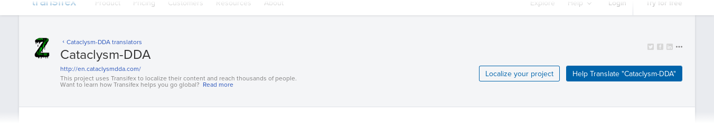
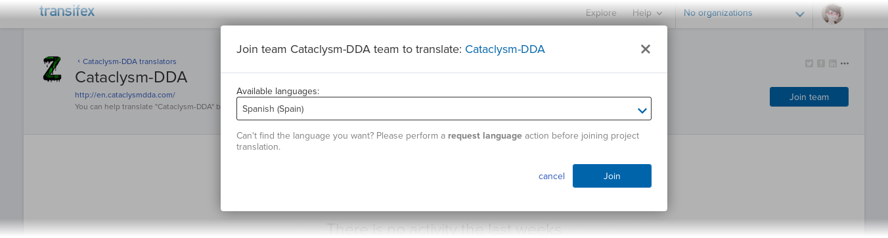
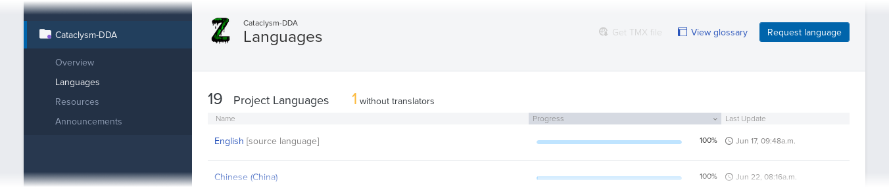
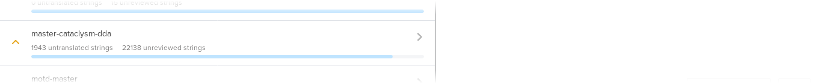
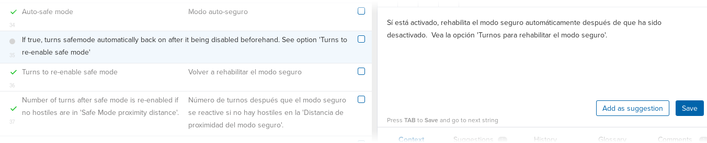

# Translating Cataclysm: DDA

## Translators

The official location for translating Cataclysm: DDA is the
[Transifex translations project][1].

Some of the currently supported languages are:

* Arabic
* Bulgarian
* Chinese (Simplified)
* Chinese (Traditional)
* Dutch
* Esperanto
* French
* German
* Italian (Italy)
* Japanese
* Korean
* Polish
* Portuguese (Brazil)
* Russian
* Serbian
* Spanish (Argentina)
* Spanish (Spain)
* Turkish

Don't see your language in the list above? You can add it into the project at
Transifex!

If you have any questions or comments about translation, feel free to post in
the [Translations Team Discussion][2] subforum.

### Getting Started

To begin translating, head over the [translation project][1] and click on the
"Help Translate Cataclysm: DDA" button.
This should take you to a page where you can either create a free account on
Transifex, or login using GitHub, Google+ or LinkedIn.



After you've created your account, return to the [translation project][1] and
click on the "Join team" button.
This will open a window where you can choose the language you are interested on
translating, so pick one and click the "Join" button.



After this, the most straightforward thing to do is to reload the page,
which should redirect you to the translation project's dashboard.
Here, you can click the "Languages" link on the sidebar to see the list of
supported languages and the current progress of the translation effort.

Note that you can request for the inclusion of additional languages,
if the one you are interested in is not available on the list.



From this list, you can click on the language of your choice, and then click on
the "Translate" to get started right away. Otherwise, you can click on any
other language and click on the "Join team" button, if you are interested in
translating for that language as well.

After clicking on the "Translate" button, you will be taken to the web editor.
To begin, you need to choose a resource to translate. Most of the in-game text
is contained in the `master-cataclysm-dda` resource, so click on it to start.



At this point, the editor should show you the list of text available for
translation, now you only need to click on the string you want to translate and
type your translation on the translation area on the right side of the screen.
Click on the "Save" button when you are satisfied with your translation.



See [Transifex's documentation][3] for more information.

### Grammatical gender

For NPC dialogue (and potentially other strings) some languages may wish to
have alternate translations depending on the gender of the conversation
participants.  This two pieces of initial configuration.

1. The dialogue must have the relevant genders listed in the json file defining
   it.  See [the NPC docs](NPCs.md).
2. Each language must specify the genders it wishes to use via the translation
   of `grammatical gender list`.  This should be a space-separated list of
   genders used in this language for such translations.  Don't add genders here
   until you're sure you will need them, because it will make more work for
   you.  If you need different genders than are currently supported you must
   add them to the `all_genders` lists in `lang/extract_json_strings.py` and
   `src/translations.cpp`.

Having done this, the relevant dialogue lines will appear multiple times for
translation, with different genders specified in the message context.  For
example, a context of `npc:m` would indicate that the NPC participant in the
conversation is male.

Because of technical limitations, all supported genders will appear as
contexts, but you only need to provide translations for the genders listed in
`grammatical gender list` for your language.

Other parts of the game have various ad hoc solutions to grammatical gender, so
don't be surprised to see other contexts appearing for other strings.

### Tips

There are issues specific to Cataclysm: DDA which translators should be aware of.
These include the use of terms like `%s` and `%3$d` (leave them as they are),
and the use of tags like `<name>`, which shouldn't be translated.

Information about these and any other issues specific to individual languages,
can be found in Cataclysm: DDA's [language notes folder][4].

General notes for all translators are in `README_all_translators.txt`,
and notes specific to a language may be stored as `<lang_id>.txt`,
for example `de.txt` for German.

Cataclysm: DDA has more than 14000 translatable strings, but don't be discouraged.
The more translators there are, the easier it becomes 😄.

## Developers

Cataclysm: DDA uses [GNU gettext][5] to display translated texts.

Using `gettext` requires two actions:

* Marking strings that should be translated in the source code.
* Calling translation functions at run time.

Marking translatable string allows for their automatic extraction.
This process generates a file that maps the original string (usually in English)
as it appears in the source code to the translated string.
These mappings are used at run time by the translation functions.

Note that only extracted strings can get translated, since the original string
is acting as the identifier used to request the translation.
If a translation function can't find the translation, it returns the original
string.

### Translation Functions

In order to mark a string for translation and to obtain its translation at
runtime, you should use one of the following functions and classes.

String *literals* that are used in any of these functions are automatically
extracted. Non-literal strings are still translated at run time, but they won't
get extracted.

#### `_()`

This function is appropriate for use on simple strings, for example:

```c++
const char *translated = _( "text marked for translation" )
```

It also works directly:

```c++
add_msg( _( "You drop the %s." ), the_item_name );
```

Strings from the JSON files are extracted by the `lang/extract_json_strings.py`
script, and can be translated at run time using `_()`. If translation context
is desired for a JSON string, `class translation` can be used instead, which is
documented below.

#### `pgettext()`

This function is useful when the original string's meaning is ambiguous in
isolation. For example, the word "blue", which can mean either a color or an
emotion.

In addition to the translatable string, `pgettext` receives a context which is
provided to the translators, but is not part of the translated string itself.
This function's first parameter is the context, the second is the string to be
translated:

```c++
const char *translated = pgettext("The color", "blue")
```

#### `ngettext()`

Some languages have complex rules for plural forms. `ngettext` can be used to
translate these plurals correctly. Its first parameter is the untranslated
string in singular form, the second parameter is the untranslated string in
plural form and the third one is used to determine which one of the first two
should be used at run time:

```c++
const char *translated = ngettext("one zombie", "many zombies", num_of_zombies)
```

### `translation`

There are times when you want to store a string for translation, maybe with
translation context; Sometimes you may also want to store a string that needs no
translation. `class translation` in `translations.h|cpp` offers the above
functionality in a single wrapper.

```c++
const translation text = translation( "Context", "Text" );
```

```c++
const translation text = translation( "Text without context" );
```

```c++
const translation text = no_translation( "This string will not be translated" );
```

The string can then be translated/retrieved with

```c++
const std::string translated = text.translated();
```

`class translation` can also be read from JSON. The method `translation::deserialize()`
handles deserialization from a `JsonIn` object, so it can be read from JSON
using the appropriate JSON functions. The corresponding JSON syntax for strings
with context is as follows:

```JSON
"name": { "ctxt": "foo", "str": "bar" }
```

Do note that currently this syntax is only supported for some JSON values, which
are listed below. If you want other json strings to support
this format, look at `translations.h|cpp` and migrate the corresponding code to
it. Changes to `extract_json_strings.py` might also be needed, since with the
new syntax "name" would be a `dict`, which may break unmigrated script.

| Supported JSON values
|---
| Effect names
| Item action names
| Item category names
| Activity verbs
| Gate action messages
| Spell names and descriptions
| Terrain/furniture descriptions
| Monster melee attack messages
| Morale effect descriptions
| Mutation names/descriptions
| NPC class names/descriptions
| Tool quality names
| Skill names/descriptions
| Bionic names/descriptions
| Terrain bash sound descriptions
| Trap-vehicle collision sound descriptions
| Vehicle part names/descriptions

### Recommendations

In Cataclysm: DDA, some classes, like `itype` and `mtype`, provide a wrapper
for the translation functions, called `nname`.

When an empty string is marked for translation, it is always translated into
debug information, rather than an empty string.
On most cases, strings can be considered to be never empty, and thus always
safe to mark for translation, however, when handling a string that can be empty
and *needs* to remain empty after translation, the string should be checked for
emptiness and only passed to a translation function when is non-empty.

Error and debug messages must not be marked for translation.
When they appear, the player is expected to report them *exactly* as they are
printed by the game.

See the [gettext manual][6] for more information.

## Maintainers

Several steps need to be done in the correct order to correctly merge and maintain the translation files.

There are scripts available for these, so usually the process will be as follows:

1. Download the translations in `.po` format.
2. Put them in `lang/incoming/`, ensuring they are named consistently with the files in `lang/po/`.
3. Run `lang/update_pot.sh` to update `lang/po/cataclysm-dda.pot`.
4. Run `lang/merge_po.sh` to update `lang/po/*.po`. (This is only used to test translations locally as the project now uses Transifex for translation)

    This will also merge the translations from `lang/incoming/`.

These steps should be enough to keep the translation files up-to-date.

To compile the .po files into `.mo` files for use, run `lang/compile_mo.sh`. It will create a directory in `lang/mo/` for each language found.

Also note that both `lang/merge_po.sh` and `lang/compile_mo.sh` accept arguments specifying which languages to merge or compile. So to compile only the translation for, say, Traditional Chinese (zh_TW), one would run `lang/compile_mo.sh zh_TW`.

After compiling the appropriate .mo file, if your system is using that language, the translations will be automatically used when you run cataclysm.

If your system locale is different from the one you want to test, the easiest way to do so is to find out your locale identifier, compile the translation you want to test, then rename the directory in `lang/mo/` to your locale identifier.

So for example if your local language is New Zealand English (en_NZ), and you want to test the Russian (ru) translation, the steps would be `lang/compile_mo.sh ru`, `mv lang/mo/ru lang/mo/en_NZ`, `./cataclysm`.


[1]: https://www.transifex.com/cataclysm-dda-translators/cataclysm-dda/
[2]: https://discourse.cataclysmdda.org/c/game-talk/translations-team-discussion
[3]: https://docs.transifex.com/
[4]: ../lang/notes
[5]: https://www.gnu.org/software/gettext/
[6]: https://www.gnu.org/software/gettext/manual/index.html
